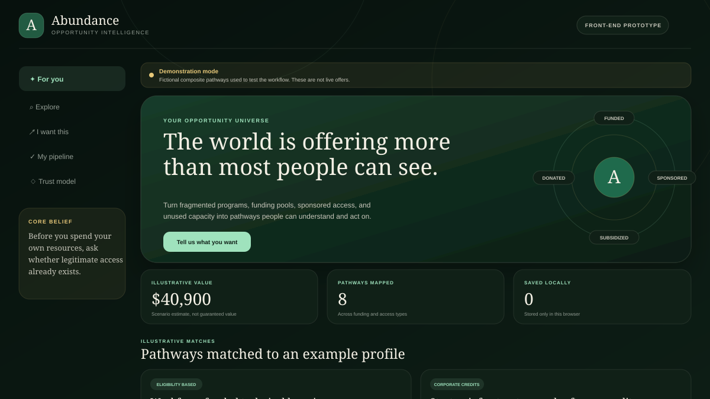
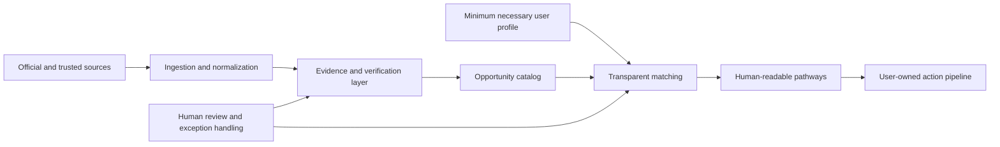

# Abundance

**Make hidden access visible.**

Abundance is an evidence-aware opportunity intelligence prototype that helps people discover, understand, and act on legitimate funded, sponsored, donated, subsidized, and no-cost resources.

[Open the public product prototype](https://theabundanceapp.base44.app/) · [Explore the methodology](docs/METHODOLOGY.md) · [Review trust and safety](docs/TRUST_AND_SAFETY.md)



## The idea

The world contains scholarships, workforce funding, public benefits, nonprofit capacity, corporate credits, sponsored access, donated goods, and community resources. The problem is not only that these opportunities are fragmented. People often do not know what to search for, which sources to trust, whether they qualify, or what to do next.

Abundance starts with a different question:

> Before you spend your own resources, has someone already created a legitimate pool of funding, access, generosity, or unused capacity for what you need?

The product vision is not a bigger directory. It is a system that turns scattered opportunity information into transparent, personalized action pathways.

## Product loop

1. **Describe the outcome.** Start with what the person wants to make possible.
2. **Map funding paths.** Look across public programs, philanthropy, employer benefits, sponsorships, community capacity, and corporate credits.
3. **Verify the evidence.** Preserve the official source, terms, dates, eligibility language, and funding classification.
4. **Explain the match.** Show why a pathway may fit without claiming final eligibility or guaranteed selection.
5. **Move toward action.** Help the person save, verify, prepare, apply, follow up, and learn.

## What the repository contains

| Component | Purpose |
| --- | --- |
| `index.html` | Accessible single-page product prototype |
| `assets/styles.css` | Responsive dark and light visual system |
| `assets/app.js` | Demonstration matching, filtering, dialog, and local pipeline interactions |
| `docs/METHODOLOGY.md` | Proposed evidence and matching workflow |
| `docs/TRUST_AND_SAFETY.md` | Product boundaries, privacy principles, and AI limits |
| `docs/ARCHITECTURE.md` | Current prototype and target technical architecture |
| `docs/ROADMAP.md` | Evidence-gated path from prototype to pilot |
| `scripts/validate_repo.py` | Dependency-free repository validation |

## What is real today

This repository contains a **front-end prototype**, not a production opportunity database.

- The interface, navigation, filtering, reverse-search flow, details dialog, theme preference, and browser-local pipeline are functional.
- Every opportunity in the repository prototype is a fictional composite created to test the workflow.
- No live source ingestion, authentication, eligibility determination, application submission, or guaranteed-value calculation is implemented here.
- The separate [public Base44 prototype](https://theabundanceapp.base44.app/) demonstrates the broader product direction.

This distinction is intentional. Abundance should not manufacture certainty while demonstrating possibility.

## Trust by design

Abundance treats trust as product infrastructure. A production record should distinguish among:

- truly no-cost access;
- fully funded support if selected;
- income-based or eligibility-based support;
- partial subsidies;
- reimbursements;
- promotional trials, which should normally be excluded or clearly marked.

AI may assist with normalization, classification, summarization, and plain-language explanation. It should not declare final eligibility, guarantee an award, invent missing terms, or apply without the user's informed consent.

Read the complete [trust and safety boundaries](docs/TRUST_AND_SAFETY.md).

## System direction



The recommended first production slice is intentionally narrow: one geography, a limited set of opportunity categories, clear source standards, and human review before broad automation. See [Architecture](docs/ARCHITECTURE.md) and [Roadmap](docs/ROADMAP.md).

## Run locally

No package installation is required.

```bash
python3 -m http.server 8000
```

Then open `http://localhost:8000`.

Run the repository checks with:

```bash
python3 scripts/validate_repo.py
node --check assets/app.js
```

## Portfolio ecosystem

Abundance is one part of a broader systems-building practice:

- [PHIL, Personal Health Intelligence Layer](https://phil-health-map.imani-kirika116.chatgpt.site/) translates fragmented health information into a human-readable personal health map.
- [From Signal to Safeguard](https://github.com/Iamlegend-Imani/FromSignaltoSafeguard) translates AI-cyber risk evidence into human-owned escalation paths, safeguards, and auditable decision records.

Across all three projects, the shared practice is consistent: make complexity legible, preserve uncertainty, keep consequential decisions human-owned, and turn information into action.

## Creator note

I build human-centered systems that turn complexity into clarity and information into action. Abundance began with a belief that access is often hidden inside fragmented systems, unfamiliar language, and disconnected pools of support. The product asks what becomes possible when those systems are made visible without making claims the evidence cannot support.

Concept and systems design by **Imani-Faith Kirika**.

## License and reuse

This repository does not currently grant an open-source license. Please do not copy, redistribute, or reuse the source without written permission from the project creator.
