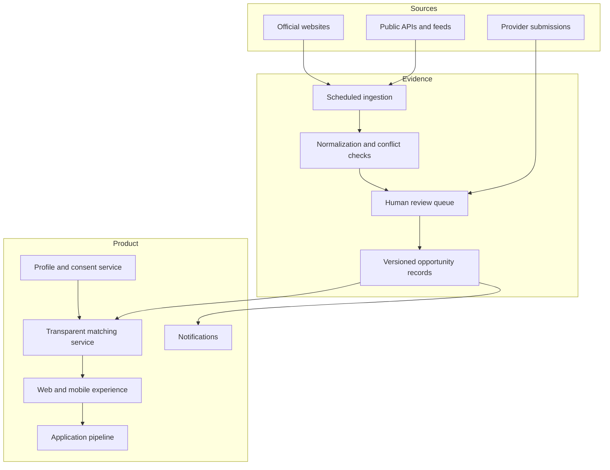

# Architecture

## Current repository prototype

The current prototype is intentionally simple:

```text
index.html
  -> assets/styles.css
  -> assets/app.js
       -> fictional composite opportunity data
       -> rule-based demonstration matching
       -> browser-local saved pipeline
```

There is no server, account system, external API, production database, or live ingestion process in this repository.

## Target production architecture



## Recommended first production slice

- **Frontend:** TypeScript web application with accessible server-rendered routes.
- **API:** Typed service layer for opportunities, matches, saves, and review actions.
- **Database:** PostgreSQL with versioned source and verification records.
- **Authentication:** Passwordless or standards-based authentication with clear consent controls.
- **Ingestion:** Scheduled jobs limited to approved sources, with retry and change detection.
- **Review:** Human queue for conflicts, high-value listings, and ambiguous eligibility.
- **Search:** Structured filters and full-text search before adding embeddings.
- **AI services:** Bounded extraction, classification, and explanation behind validation and review gates.
- **Observability:** Source failures, stale records, user reports, and review latency.

## Core records

### Opportunity

- stable identifier;
- provider and official source;
- source type and geography;
- normalized title and description;
- funding classification;
- eligibility text and structured criteria;
- deadline and availability state;
- value basis and participant costs;
- last verified timestamp;
- evidence and review status.

### User preference profile

- goals and categories;
- geography and travel flexibility;
- timing and effort preferences;
- explicit optional eligibility attributes;
- privacy and notification choices.

### Match explanation

- opportunity and user identifiers;
- matched criteria;
- unknown or conflicting criteria;
- evidence state;
- plain-language explanation;
- generated and reviewed timestamps.

### Action pipeline

- saved, verifying, preparing, applied, closed, or claimed state;
- next action and deadline;
- user notes;
- source snapshot used for the decision;
- outcome supplied by the user.

## AI controls

1. Retrieve only approved source content.
2. Produce structured output against a strict schema.
3. Reject or route records with missing required evidence.
4. Preserve source text for comparison.
5. Require human review for defined high-risk conditions.
6. Log model, prompt, source version, and reviewer action.
7. Never let a model-generated summary overwrite the authoritative source.

## Nonfunctional requirements

- accessible keyboard and screen-reader interaction;
- mobile-responsive layout;
- encryption and least-privilege access;
- source and decision auditability;
- reversible user consent;
- clear failure and stale-data states;
- measurable verification service levels;
- graceful operation without AI when structured data is sufficient.

